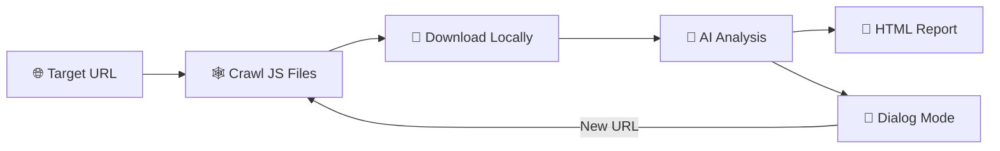

<div align="center">
  <h1>🕵️ Js-Scanner</h1>
  <p><strong>AI-Powered JavaScript Security Audit Tool</strong></p>

  <p>
    
    
    
    
    
  </p>

  <br>

  

  <br><br>
  <p><b>🔍 Crawl · 🤖 Analyze · 📄 Report · 💬 Chat</b></p>
  <p><i>Let AI uncover the gold in your JS files — quietly and efficiently.</i></p>
</div>

---

## 📋 Overview

Js-Scanner automates the nightmare of manually digging through JavaScript files for API endpoints, hardcoded secrets, JWTs, and sensitive data. It crawls every JS file on a target site, runs them through AI (DeepSeek / OpenAI / local models), and produces a beautiful interactive HTML report — then lets you keep asking questions in a chat-like dialog.



---

## ✨ Features

| | |
|---|---|
| 🕸️ **Headless Crawler** | Automatically discovers every JS file using Playwright, bypasses SSL errors |
| 🤖 **Multi-Model AI** | Supports DeepSeek, OpenAI, and local Ollama models |
| 🔐 **Deep Scan** | Finds API endpoints, hardcoded keys, JWT tokens, secrets, PII, internal IPs |
| 🖥️ **Interactive Report** | Expand/collapse files, one-click copy all findings or just API endpoints |
| 💬 **Chat Mode** | Ask follow-up questions about findings — or paste a new URL to scan |
| 📦 **Portable EXE** | Package as a single-file Windows executable with no Python needed |

---

## 🚀 Quick Start

### 1. Install

```bash
# Clone
git clone https://github.com/riteshekbote/Js-Scanner.git
cd Js-Scanner

# Dependencies
pip install -r requirements.txt
playwright install chromium
```

### 2. Configure

Create `config.ini` in the project root:

```ini
[AI]
api_base = https://api.deepseek.com
api_key = sk-your-actual-key
model = deepseek-chat
temperature = 0.1
max_tokens = 8192
min_confidence = 0.0

[App]
report_dir = reports
cache_dir = js_cache
auto_open_report = false
```

### 3. Run 🎯

**Interactive mode** (recommended):

```bash
python src/main.py
```

**Single scan**:

```bash
python src/main.py https://example.com
```

---

## ⚙️ Configuration Reference

| Config | Values | Description |
|--------|--------|-------------|
| `api_base` | URL | OpenAI-compatible API endpoint |
| `api_key` | string | Your API key |
| `model` | string | Model name (`deepseek-chat`, `gpt-4o-mini`, `llama3`, etc.) |
| `temperature` | `0.0` – `1.0` | Lower = more deterministic output (audit: `0.1`) |
| `max_tokens` | int | Max tokens per AI response |
| `min_confidence` | `0.0` – `1.0` | Filters findings below this threshold (`0.0` = keep all) |
| `report_dir` | path | Where HTML reports are saved |
| `cache_dir` | path | Where downloaded JS files are cached |
| `auto_open_report` | `true` / `false` | Auto-open report in browser (Windows) |

### AI Provider Examples

| Provider | `api_base` | `api_key` | `model` |
|----------|------------|-----------|---------|
| **DeepSeek** | `https://api.deepseek.com` | Your DeepSeek key | `deepseek-chat` |
| **OpenAI** | `https://api.openai.com/v1` | Your OpenAI key | `gpt-4o-mini` |
| **Ollama (local)** | `http://localhost:11434/v1` | Any string (`ollama`) | `llama3` / your model |

---

## 📊 Report Preview

| Stat Card | Findings Table |
|-----------|---------------|
|  |  |

The report includes:
- 📊 **Stats cards** — files scanned, total findings, critical & high-risk counts
- 🏷️ **Type distribution** — API endpoints, hardcoded secrets, PII, and more
- 🔍 **Per-file drilldown** — type, leaked value, code context, risk level, fix suggestion, confidence %
- 📋 **One-click copy** — all findings as TSV (paste into Excel) or just API endpoints

---

## 💬 Dialog Mode

After an audit, you enter an interactive chat with the AI:

```
🔍 You: what does the secret_key in config.js do?
🤖 AI: That looks like a Stripe API secret key starting with sk_live_. 
         It's a production key — anyone with access can charge real cards.

🔍 You: https://another-site.com
🔄 New URL detected, starting audit...
✅ New audit complete, context updated.
```

Commands: `exit` / `quit` / `help` / `clear` / `history`

---

## 📦 Packaging

Build a standalone Windows EXE:

```bash
python build_exe.py
```

Output: `dist/API_Agent.exe` — no Python environment required.

> ⚠️ The target machine still needs Playwright browsers. Run `playwright install chromium` on it.

---

## ❓ FAQ

<details>
<summary><b>🔴 SSL certificate errors?</b></summary>

The tool already ignores SSL errors (`verify=False` in both Playwright and requests). If it still fails, check that the target site is actually reachable.
</details>

<details>
<summary><b>⚪ AI returns nothing / report is empty?</b></summary>

- Verify `api_key` in `config.ini`
- Try `min_confidence = 0.0`
- Make sure your model supports OpenAI-compatible chat completions
</details>

<details>
<summary><b>🟡 Too many false positives?</b></summary>

Raise `min_confidence` (e.g. `0.7`). You can also extend `is_likely_placeholder()` in `ai_analyzer.py`.
</details>

<details>
<summary><b>🔄 Scan a new site mid-session?</b></summary>

Just paste the URL into the dialog — the agent detects it, scans, and updates context automatically.
</details>

<details>
<summary><b>🔐 Analyze authenticated/logged-in sites?</b></summary>

No built-in auth yet. Modify `crawler.py` to inject cookies via `page.context.add_cookies([...])`.
</details>

<details>
<summary><b>📁 Analyze local JS files?</b></summary>

Designed for live websites. For local files, enter a file path as the URL (not recommended) or extend the code yourself.
</details>

---

## 🧰 Advanced Customization

- **Custom rules** — edit the `prompt` and `is_likely_placeholder()` in `ai_analyzer.py`
- **Truncation** — change `max_chars` in `ai_analyzer.py` (default: 300,000 chars)
- **Batch scans** — loop in a shell script:
  ```bash
  for url in $(cat targets.txt); do python src/main.py "$url"; done
  ```

---

## 🧯 Tech Stack

| Component | Library |
|-----------|---------|
| 🤖 AI Client | [`openai`](https://pypi.org/project/openai/) |
| 🕸️ Headless Browser | [`playwright`](https://playwright.dev/python/) |
| 📄 Report Engine | [`jinja2`](https://pypi.org/project/Jinja2/) |
| 🌐 HTTP Client | [`requests`](https://pypi.org/project/requests/) |

---

## ⚠️ Disclaimer

> This tool is for **authorized security testing** and **self code review only**.  
> **Do not** use it on systems you do not own or have explicit permission to test.  
> AI analysis may produce false positives or miss real issues — **always manually verify critical findings**.

---

## 📄 License

[MIT](LICENSE) © riteshekbote

---

<div align="center">
  <p>⭐ Found this useful? Give it a star!</p>
  <p><a href="https://github.com/riteshekbote/Js-Scanner/issues">Report Bug</a> · <a href="https://github.com/riteshekbote/Js-Scanner/issues">Request Feature</a></p>
</div>
